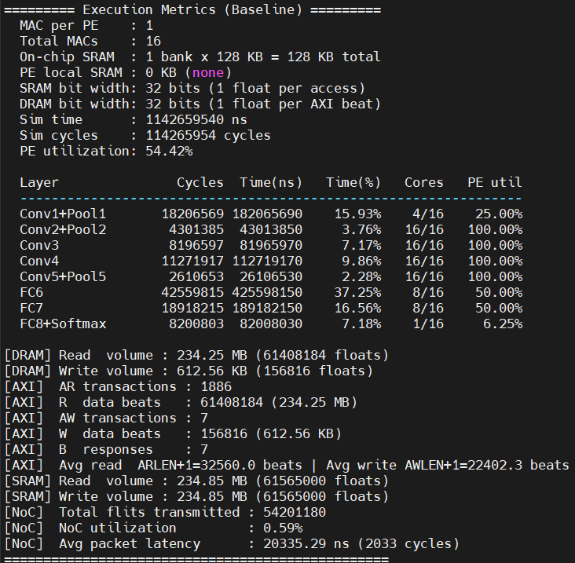
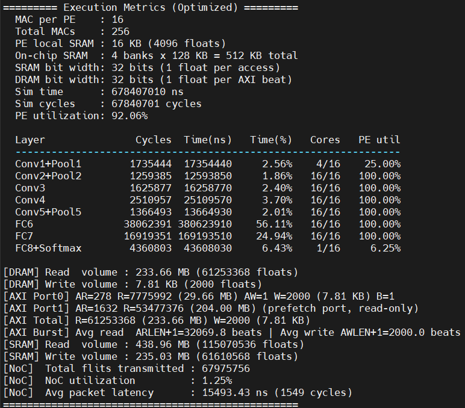

# NoC-based CNN Accelerator System with AXI4 DMA Architecture & Design Optimization
SystemC is a C++-based hardware description language that enables behavioral simulation of digital systems at a high level of abstraction, allowing designers to verify functional correctness and evaluate performance trade-offs — including execution cycles, memory access volume, and resource utilization — before committing to RTL implementation. This project uses SystemC to simulate a Network-on-Chip (NoC) based CNN accelerator running AlexNet inference on a 4×4 mesh with 16 processing cores, providing early insight into the design space of compute resources, memory hierarchy, and data movement efficiency.

## Problem Formulation
The project requires building a NoC-based CNN accelerator system in SystemC that replaces ROM-based data storage with an external DRAM model accessible only through an AXI4-based DMA. The system must include a DRAM model with a clearly defined memory map, an AXI4 DMA with five independent channels supporting burst transfers and VALID/READY handshake, a PE array of at least 4×4 cores connected by a mesh NoC, and a controller coordinating data movement and computation. Both `make cat` and `make dog` must produce exactly correct top-100 classification results.
 
In addition to the baseline implementation, an optimized version must be proposed and compared against the baseline. The optimization is not limited to reducing execution cycles; it may target any aspect of the design including memory hierarchy, dataflow, NoC communication, or compute resources, with clear trade-off analysis presented in the report.

## Features
- **4×4 Mesh NoC**: 16 routers with XY routing, deadlock-free deterministic paths, and 5-stage pipeline (SyncIn -> ElasticBuffer -> RouteComputation -> Arbiter/Crossbar -> SyncOut)
- **AXI4 DMA**: 5-channel protocol (AR/R/AW/W/B) with VALID/READY handshake, INCR burst, and ARLEN/AWLEN/ARSIZE/AWSIZE signal support; dual master ports in optimized design for concurrent DMA access
- **Three-level memory hierarchy**:
  - *DRAM* (352 MB): external storage for all AlexNet weights, biases, image, intermediate data, and output
  - *On-chip SRAM*: shared staging buffer between DMA and PE array; single-bank 128 KB in baseline, 4-bank 512 KB with dedicated roles per bank in optimized
  - *PE local SRAM* (optimized only): 16 KB per PE as partial sum buffer for output stationary Conv dataflow
- **MAC Delay Model**: compute cycles estimated as `ceil(MAC_ops / MAC_PER_PE)` and injected via `wait()` for realistic cycle-count simulation
- **OS (Conv) + WS (FC) Dataflow**: selected for single-inference efficiency — OS reduces NoC round-trips for Conv, WS minimizes FC communication volume
- **FC Weight Tile Ping-Pong** (optimized only): weight tiled to bank size, DMA prefetch and PE compute overlapped via dual AXI ports
- **Execution Metrics**: per-layer cycle breakdown, PE utilization, DRAM/SRAM/AXI/NoC statistics

## Processing Pipeline
1. **DRAM Initialization**: All weights, biases, and the input image are loaded from the data folder into DRAM before simulation starts; all subsequent accesses go through the AXI DMA.
2. **Image Load**: Controller issues an AXI burst read to transfer the input image from DRAM through the SRAM Bank 0 staging buffer.
3. **Conv1–5 Execution**: For each layer, weights are DMA-loaded into the SRAM weight buffer (Bank 3), then the controller broadcasts the input FM, weight slice, and bias to assigned cores via NoC. Each core executes convolution and pooling under output stationary dataflow, accumulating partial sums in PE local SRAM (optimized only), and returns results to the controller.
4. **Feature Map Management**: Output FMs exceeding SRAM capacity are spilled to DRAM (baseline); the 512 KB SRAM in the optimized design eliminates all spills.
5. **FC6–7 Execution**: Weights are loaded and distributed to cores via PKT_FC_W under weight stationary dataflow; the small input activation vector is then broadcast. In the optimized design, Ping-Pong DMA overlaps weight tile loading with PE computation.
6. **FC8 + Softmax**: Executed on Core 15, producing 1000-class linear output and softmax probabilities.
7. **Output Write-back**: Results (2,000 floats) are written back to the DRAM output region via AXI DMA before being read back and printed as top-100 classification results.

## Parameters
### FP (Baseline)
- **PE array**: 16 PEs (4×4 mesh), 1 MAC unit per PE, 16 MACs total
- **PE local SRAM**: None
- **On-chip SRAM**: 1 bank × 128 KB = 128 KB total, 32-bit data width, 1-cycle read/write latency
- **DRAM**: 352 MB flat array, 32-bit per AXI beat, sequential burst access
- **AXI DMA**: Single master port, 5 independent channels, INCR burst, no outstanding transactions
- **CORES_CONV1**: 4 / **CORES_CONV2–5**: 16 / **CORES_FC6–7**: 8 / **CORE_FC8**: 1 (Core 15)
- **Clock period**: 10 ns
- **Tile size**: 32,768 floats per NoC packet tile

### FP_Optimized
- **PE array**: 16 PEs (4×4 mesh), 16 MAC units per PE, 256 MACs total
- **PE local SRAM**: 16 KB per PE (4,096 floats), used as partial sum buffer for Conv2–5 OS dataflow
- **On-chip SRAM**: 4 banks × 128 KB = 512 KB total, 32-bit data width, independent read/write per bank
  - Bank 0 (INPUT\_PING): input FM streaming buffer (Conv) / input activation lock (FC)
  - Bank 1 (INPUT\_PONG): unused in Conv / weight tile Ping — PE reads (FC)
  - Bank 2 (OUTPUT): unused in Conv / weight tile Pong — DMA prefetch (FC)
  - Bank 3 (WEIGHT): weight tile DMA staging (Conv) / bias buffer (FC)
- **DRAM**: 352 MB flat array, 32-bit per AXI beat
- **AXI DMA**: Dual master ports (Port 0: main thread, Port 1: prefetch thread), 5 independent channels per port, INCR burst, no outstanding transactions
- **CORES_CONV1**: 4 / **CORES_CONV2–5**: 16 / **CORES_FC6–7**: 16 / **CORE_FC8**: 1 (Core 15)
- **Clock period**: 10 ns
- **Tile size**: 32,768 floats per NoC packet tile / per SRAM bank (FC weight tiling)

## Input / Output Format
### Input
Each file stores values in plain text, one value per line, rounded to 6 decimal places.
Layout follows PyTorch's default order: `[out_ch][in_ch][kH][kW]` for weights, `[out_ch]` for biases.

### Output
Baseline (simulation is about 30mins)
```
========= Execution Metrics (Baseline) =========
MAC per PE    : 1
Total MACs    : 16
On-chip SRAM  : 1 bank x 128 KB = 128 KB total
PE local SRAM : 0 KB (none)
SRAM bit width: 32 bits (1 float per access)
DRAM bit width: 32 bits (1 float per AXI beat)
Sim time      : 1142659540 ns
Sim cycles    : 114265954 cycles
PE utilization: 54.42%

Layer               Cycles  Time(ns)   Time(%)   Cores   PE util
----------------------------------------------------------------
Conv1+Pool1       18206569 182065690    15.93%    4/16    25.00%
Conv2+Pool2        4301385  43013850     3.76%   16/16   100.00%
Conv3              8196597  81965970     7.17%   16/16   100.00%
Conv4             11271917 112719170     9.86%   16/16   100.00%
Conv5+Pool5        2610653  26106530     2.28%   16/16   100.00%
FC6               42559815 425598150    37.25%    8/16    50.00%
FC7               18918215 189182150    16.56%    8/16    50.00%
FC8+Softmax        8200803  82008030     7.18%    1/16     6.25%

[DRAM] Read  volume : 234.25 MB (61408184 floats)
[DRAM] Write volume : 612.56 KB (156816 floats)
[AXI]  AR transactions : 1886
[AXI]  R  data beats   : 61408184 (234.25 MB)
[AXI]  AW transactions : 7
[AXI]  W  data beats   : 156816 (612.56 KB)
[AXI]  B  responses    : 7
[AXI]  Avg read  ARLEN+1=32560.0 beats | Avg write AWLEN+1=22402.3 beats
[SRAM] Read  volume : 234.85 MB (61565000 floats)
[SRAM] Write volume : 234.85 MB (61565000 floats)
[NoC]  Total flits transmitted : 54201180
[NoC]  NoC utilization         : 0.59%
[NoC]  Avg packet latency      : 20335.29 ns (2033 cycles)
=================================================
```

Optimized (simulation is about 20mins)
```
========= Execution Metrics (Optimized) =========
MAC per PE    : 16
Total MACs    : 256
PE local SRAM : 16 KB (4096 floats)
On-chip SRAM  : 4 banks x 128 KB = 512 KB total
SRAM bit width: 32 bits (1 float per access)
DRAM bit width: 32 bits (1 float per AXI beat)
Sim time      : 678407010 ns
Sim cycles    : 67840701 cycles
PE utilization: 92.06%

Layer               Cycles  Time(ns)   Time(%)   Cores   PE util
----------------------------------------------------------------
Conv1+Pool1        1735444  17354440     2.56%    4/16    25.00%
Conv2+Pool2        1259385  12593850     1.86%   16/16   100.00%
Conv3              1625877  16258770     2.40%   16/16   100.00%
Conv4              2510957  25109570     3.70%   16/16   100.00%
Conv5+Pool5        1366493  13664930     2.01%   16/16   100.00%
FC6               38062391 380623910    56.11%   16/16   100.00%
FC7               16919351 169193510    24.94%   16/16   100.00%
FC8+Softmax        4360803  43608030     6.43%    1/16     6.25%

[DRAM] Read  volume : 233.66 MB (61253368 floats)
[DRAM] Write volume : 7.81 KB (2000 floats)
[AXI Port0] AR=278 R=7775992 (29.66 MB) AW=1 W=2000 (7.81 KB) B=1
[AXI Port1] AR=1632 R=53477376 (204.00 MB) (prefetch port, read-only)
[AXI Total] R=61253368 (233.66 MB) W=2000 (7.81 KB)
[AXI Burst] Avg read  ARLEN+1=32069.8 beats | Avg write AWLEN+1=2000.0 beats
[SRAM] Read  volume : 438.96 MB (115070536 floats)
[SRAM] Write volume : 235.03 MB (61610568 floats)
[NoC]  Total flits transmitted : 67975756
[NoC]  NoC utilization         : 1.25%
[NoC]  Avg packet latency      : 15493.43 ns (1549 cycles)
=================================================
```

Cat
```
Top 100 classes:
=================================================
  idx |      val | possibility | class name
-------------------------------------------------
  285 |    20.21 |       96.38 | Egyptian cat
  281 |    16.14 |        1.65 | tabby
  282 |    15.73 |        1.10 | tiger cat
  287 |    14.79 |        0.43 | lynx
  728 |    14.41 |        0.29 | plastic bag
...
```
Dog
```
=================================================
  idx |      val | possibility | class name
-------------------------------------------------
  207 |    16.59 |       38.63 | golden retriever
  175 |    15.57 |       13.86 | otterhound
  220 |    15.36 |       11.26 | Sussex spaniel
  163 |    15.00 |        7.86 | bloodhound
  219 |    14.59 |        5.22 | cocker spaniel
...
```

## Directory Structure
```
FP/
  ├── FP_Group
  │   └── <FP|FP_Optimized>
  │       ├── clockreset.cpp/.h // Clock and reset signal generation
  │       ├── config.h          // Architecture parameters and logging utilities
  │       ├── axi_dma.h         // AXI4 DMA master with 5-channel handshake protocol
  │       ├── controller.h      // Inference orchestrator managing DMA, NoC dispatch, and result collection
  │       ├── core.h            // Compute core integrating NI and PE with CNN layer execution logic
  │       ├── dram.h            // External DRAM behavior model with memory map definitions
  │       ├── sram.h            // On-chip SRAM behavior model with multi-bank support
  │       ├── pe.h              // Flit/packet definitions and NoC communication primitives
  │       ├── router.h          // 5-port mesh router with XY routing and pipeline stages
  │       ├── noc_io.h          // NoC send/receive helpers for tiled packet transfers
  │       ├── main.cpp          // Top-level module instantiation and NoC wiring
  │       ├── Makefile          // Build script to compile the project
  │       └── data/
  │
  ├── AXI_introduciton(1).pptx
  ├── mlchip_FP_2026.pdf
  ├── mlchip_FP_2026_v2.pdf
  └── README.md
```

### How to compile
To generate the executable `run`, simply run
```
make
```
### How to execute
Run the program with
```
make <cat|dog>
```

## Experiment
<p align="center">
  
</p>
<p align="center">Figure 1. Baseline result</p>

<p align="center">
  
</p>
<p align="center">Figure 2. Optimized result</p>