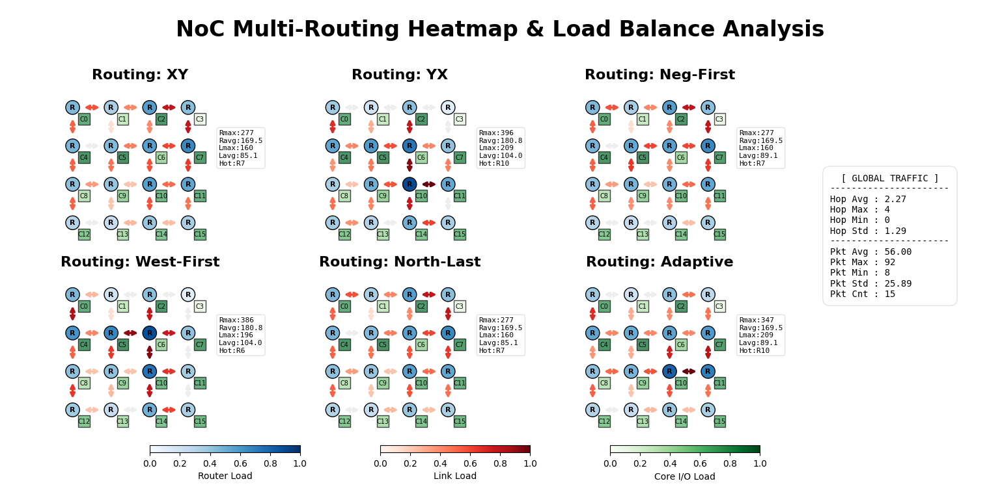

# Implement NoC by SystemC
NoC (Network-on-Chip) is a promising on-chip communication architecture that addresses the scalability and bandwidth limitations of traditional bus-based interconnects in modern many-core systems. By decoupling computation from communication, NoC enables massively parallel data transfer across a structured network of routers and links. This project implements a 4×4 mesh-based NoC using SystemC, where 16 routers and 16 cores cooperate to route variable-length data packets across the network. Each core contains a Processing Element (PE) and a Network Interface (NI), responsible for packet generation and flit-level communication with the router respectively.

## Problem Formulation
The system must correctly route variable-length data packets between arbitrary source–destination pairs across a 4×4 mesh topology. Each packet must be fragmented into 34-bit flits at the NI before injection into the network, then reassembled at the destination for PE-level verification. The router pipeline stages must be designed with cycle time derived from the provided delay table, and the routing algorithm, buffer depth, and virtual channel usage are all design choices that affect end-to-end latency. The entire simulation must complete in fewer than 1021 cycles to surpass the provided baseline.

## Features
- **Five-Stage Pipelined Router**: Each router is divided into five pipeline stages — Sync In, Elastic Buffer (EB), Route Computation (RC), Arbiter + Crossbar (XB), and Sync Out — with a clock period of 0.5 ns derived from the critical path delay of the provided functional block table.
- **XY Deterministic Routing**: Route computation follows the XY routing algorithm, first resolving horizontal displacement then vertical, guaranteeing deadlock-free packet delivery across the 4×4 mesh.
- **Flit-Level Packetization**: Each packet is decomposed into 34-bit flits at the NI before injection. The two most significant bits identify the flit type (header: 2, body: 0, tail: 1), with the header carrying source and destination IDs and subsequent flits carrying floating-point payload data.
- **4-Phase Handshake Protocol**: All inter-module communication uses a standard 4-phase req/ack handshake, applied uniformly to every flit across both Core–Router and Router–Router links.
- **Per-Port Arbitration**: The arbiter grants each output port exclusively to one input port at a time, holding ownership across an entire packet and releasing it only upon tail flit transmission.

## Processing Pipeline
1. **Packet Generation (PE -> NI)**: Each PE calls `get_packet()` to retrieve a packet containing a source ID, destination ID, and variable-length floating-point vector. The Core decomposes it into a header flit followed by body and tail flits, then injects them into the router via the local port using the 4-phase req/ack handshake.
2. **Stage 1 — Sync In**: The router latches the incoming flit into `sync_in_q` upon detecting a rising req signal, acknowledges the sender, and waits for req to fall, synchronizing the flit to the local clock domain.
3. **Stage 2 — Elastic Buffer**: The EB thread drains `sync_in_q` into the per-port elastic buffer `eb[]` each cycle, decoupling upstream handshake timing from downstream route computation.
4. **Stage 3 — Route Computation**: The RC thread applies XY routing on each header flit to determine the target output port, recording it in `in_target[]`. Body and tail flits inherit the same target until the tail clears the routing state.
5. **Stage 4 — Arbiter + Crossbar**: The arbiter checks whether the target output port is free, assigns ownership to the requesting input port, and forwards the flit into `xb_q[]`. Contending ports stall until ownership is released after the tail flit.
6. **Stage 5 — Sync Out**: The Sync Out thread dequeues flits from `out_q[]` and drives them onto the outgoing link via the 4-phase handshake until the downstream receiver acknowledges.
7. **Packet Reassembly and Verification (NI -> PE)**: The destination Core reassembles received flits into a Packet struct and calls `check_packet()` upon receiving the tail flit. Once all 16 PEs have successfully verified their packets, the simulation halts and prints the completion message.

## Input / Output Format

### Input
**core_#.txt**

```
FROM <source_id> <data length>
<data>
or
TO <dest_id> <data length>
<data>
```

**Example**
```
FROM 8 28
0.598394 0.911542 0.961468 0.912256 0.275784 0.957137 0.949949 0.339302 0.502295 0.253626 0.698808 0.994096 0.212257 0.787126 0.180872 0.751489 0.680774 0.550928 0.280097 0.571455 0.960178 0.852992 0.412576 0.792993 0.209662 0.205296 0.627324 0.501853 
TO 13 8
0.101351 0.770884 0.64301 0.299374 0.437017 0.754068 0.274254 0.432208 
```

### Output
The number of simulation cycles, must be lower than the baseline value of **1021**.

## Directory Structure
```
HW3/
  ├── code/
  │   ├── 09_SUBMIT/
  │   │   ├── 00_tar             // Pack source files into .tar.gz
  │   │   ├── 01_submit          // Submit and auto-verify on TA server
  │   │   └── 02_check           // Confirm submission result
  │   ├── pattern/
  │   │   └── core_#.txt 
  │   │
  │   ├── Makefile               // Build script to compile the project
  │   ├── clockreset.cpp         // Modules generating the system clock and asynchronous reset
  │   ├── clockreset.h
  │   ├── pe.cpp                 // Processing Element for loading traffic and verifying data integrity
  │   ├── pe.h
  │   ├── core.h                 // Core module integrating the PE and NI with packetization logic
  │   ├── router.h               // Implementation of the 5-stage pipeline and XY routing logic
  │   ├── main.cpp               // Main entry point
  │   └── visualizer.py          // Tool for analyzing NoC traffic and performance stats
  │
  ├── HW3.pdf
  ├── Router_Function_Delay.pptx // Presentation detailing the NoC architecture
  └── README.md
```
## Usage Guide
### How to compile and execute
The provided Makefile compiles and executes the program in one step
```
make
```
### How to submit
First, compress your code into a tar archive
```
cd 09_SUMIT
./00_tar
```
Then submit to the TA server
```
./01_submit
```
To verify your submission result
```
./02_check
```

## Experiment
<p align="center">
  
</p>
<p align="center">Figure 1. Status Analysis</p>